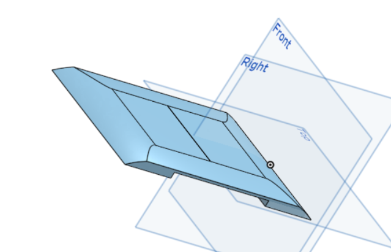

# Séance du 09/02/2022

## Agencement et calibration des pattes

La séance dernière, nous avions quelques soucis sur l'uniformité des angles de chaque patte. 

<figure align="center">
  
  <figcaption>les servos moteurs passent de 0° à 180° de la même façon.</figcaption>
</figure>

Nous avons donc placé la patte en position couché (le point minimum, la patte ne peut pas aller plus loin). Nous avons calibré le servo_genou à 90° (pour se lever le genou doit pouvoir aller dans les deux sens) et le servo_hanche à 180°.

Je me suis occupé de démonter de nouveaux les servos moteurs. On a lancé un code qui permet au chien de se maintenir debout. Ensuite, on assemble les pièces d'une patte en modifiant son degré de liberté légèrement pour que cette dernière vienne se calibrer avec les autres pattes. A la fin, notre robot se tient beaucoup plus droit.

## Premier pas sur la terre ferme

En étudiant le mouvement relatif d'une patte comme nous le percevons visuellement, nous en avons extrait les angles associés à chaque étape de la marche. Raphael a passé une longue nuit a optimisé ce mouvement :

<figure align="center">
  
</figure>

Au sol, il réalise ce déplacement : 

<figure align="center">
  
</figure>

Ensuite, Raph a optimisé le système pour que les pattes avancent en simultané avec un décalage de mouvement. Autrement dit, la patte A fait 1-2-3-4, la patte B fait 2-3-4-1 et ainsi de suite.

Pour le moment, nous en sommes arrivé à ceci :

<figure align="center">
  
</figure>

## Modélisation du corps

De mon côté, je me suis attelé à construire un corps de robot. 

Au début, nous avions une mega strong comme carte. La voici avec le bout du cable d'alimentation soudé :

<figure align="center">
  
</figure>

J'ai du rechangé tout le corps par le suite, avec la nouvelle carte de plus grande dimension : 7,62 x 5,84 cm (trous de montage à 0,38 cm de chaque bord). Nous avons alors revu la taille du robot et choisi d'augmenter la largeur pour que la carte puisse passer entre les moteurs de droite et de gauche. Il fera environ 17.6cm de large sur 42cm.

J'ai commencé par créer la plaque qui relie les 4 servo_moteurs des épaules. Le trou au milieu est pour laisser de la place à la carte fixé sur le dessus du corps

<figure align="center">
  
</figure>

Puis, je voulais que les cotes du bas englobe les moteurs avec une forme qui ressemble à un corps en chair et en os, qui épouse la forme d'une cage thoracique :

<figure align="center">
  
</figure>

Ensuite, comme on remarque sur le dessin, mon souhait était de centralisé le corps sur les moteurs des épaules. J'ai d'abord pensé mettre la carte arduino la tête en bas en la fixant sur le dessus du corps.

Mais finalement, en extrudant, la carte peut se fixer convenablement et cela sera plus pratique pour brancher les fils:

<figure align="center">
  
</figure>

Le dessus du corps pour cacher tous les fils qui dépasse :

<figure align="center">
  
</figure>

Enfin j'ai réalisé les bras de corps pour relier le corps principal au embouts des boitiers aux extremités. J'ai pas mal galéré sur ce dernier en utilisant la fonction loft, le prévoir assez grand pour que l'on puisse se permettre de faire un trou à l'intérieur et y glisser les cables d'alimentations :

<figure align="center">
  
</figure>

Après beaucoup de recherches pour de meilleures fixation et d'optimisation de design, je suis fier de vous présenter la version finale 1 du corps :

<figure align="center">
  
</figure>

Il sera encore sujet à modification. Mais je pense que globalement celui-ci et pas mal. Je vais voir avec Xavier pour les fixations entre les différentes pièces, de la meilleure chose à faire pour tout soit solide.

