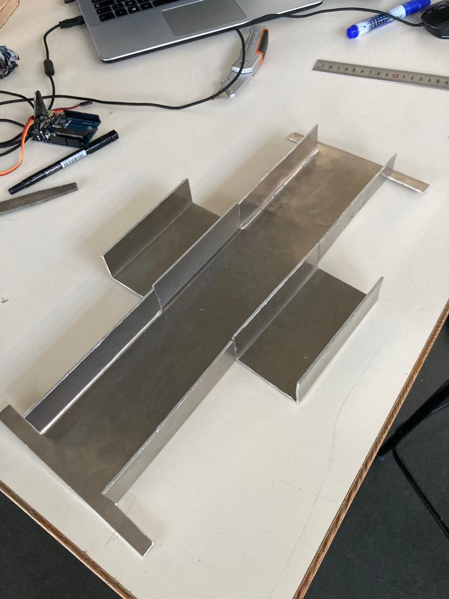
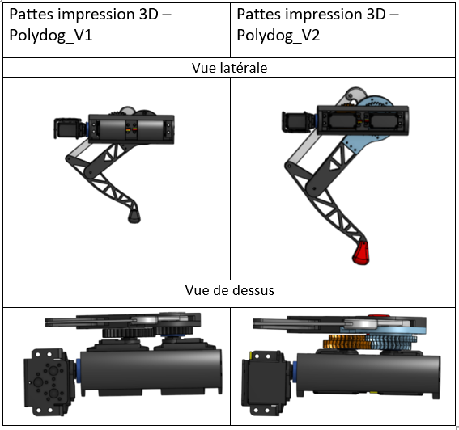
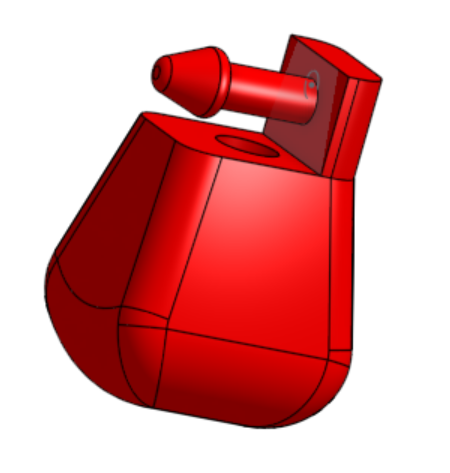

# Séance 2 - version 2 de PolyDog

## Semaine du 25 avril

-----

A castorama ou a leroy merlin, il n'y pas un éventail de taille et dimension extraordinaire. Nous avons donc constitué nos propres carrés d'alu.

On a chipé deux trois plaque d'alu de différentes épaisseur qu'on pouvait trouver.

On a commencer par la plaque d'alu, support principale du corps :

<figure align="center">
  
  <figcaption></figcaption>
</figure>

Nous avons eu un peu de mal, pour plier les bouts de métal. La plieuse apporte des contraintes au niveau des pliages suivant le premier, car la plaque ne passe plus dans la machine. On a fini le travail à coup de marteau, laissant des finitions pas tip top.

<figure align="center">
  
  <figcaption></figcaption>
</figure>

On a fait de nombreuses mesures sur la taille des découpes de l'alu pour que les pièces s'emboitent et se rivete ensemble correctement. 

//Photo des carrés d'alu avec le moteur. //

L'outils par excellence pour notre découpe a été la dremel :

<figure align="center">
  
  <figcaption>Fastidieux mais assez bien précis au mm près</figcaption>
</figure>

J'ai lancé les impressions de la nouvelle patte qui 1.3 fois plus grosse que la version 1, et avec des engrenages plus puissant et plus stable :

<figure align="center">
  
  <figcaption></figcaption>
</figure>

J'ai également modifié les trous des vis, la taille des parties en rapport avec le palonnier des servos moteurs pour que tout puisse être assemblable.

J'ai modifié le pied de la patte :

<figure align="center">
  
  <figcaption>L'embout rentre dans le tibia grâce à la matière flexible qui le compose</figcaption>
</figure>

J'ai crée cette pièce pour maintenir les roulements à bille dans l'encastrement des morceaux d'alu : 

<figure align="center">
  
  <figcaption></figcaption>
</figure>

