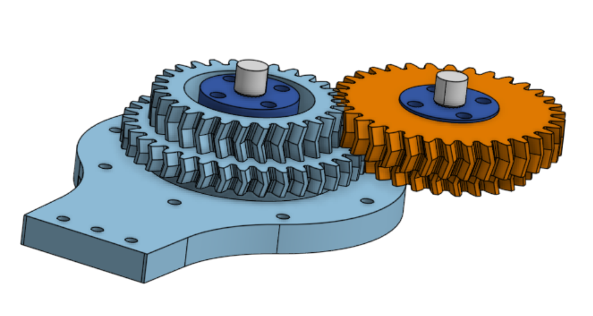
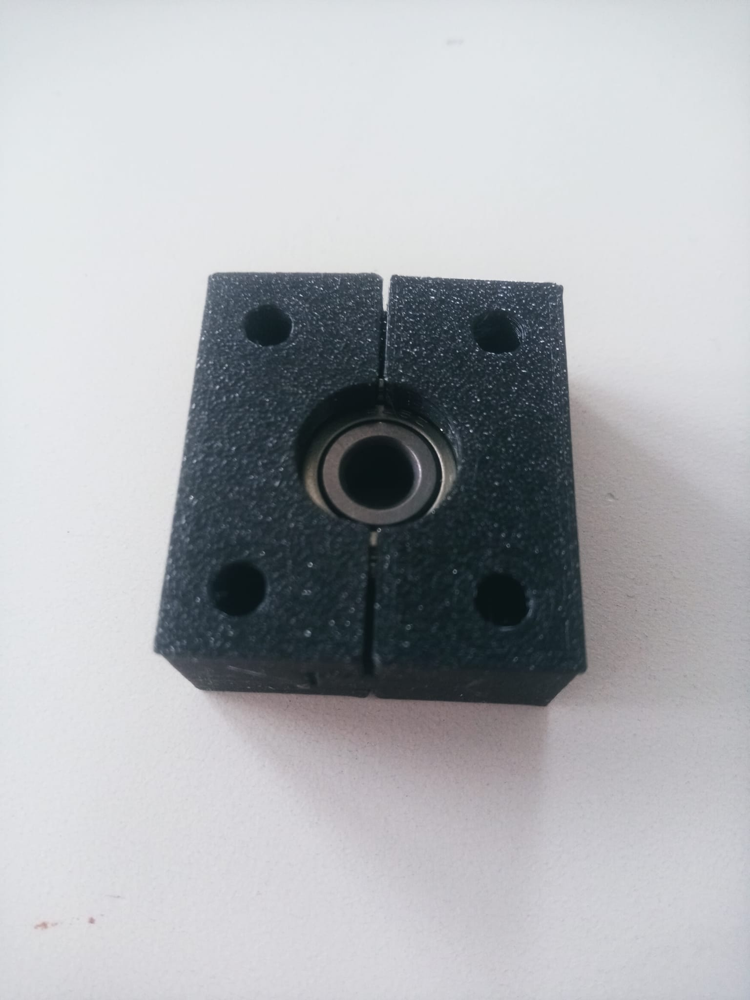
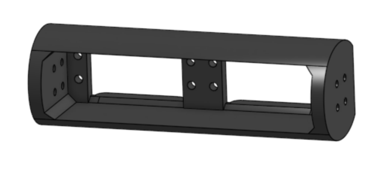
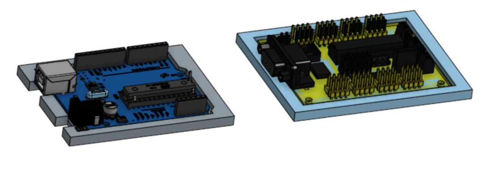

# Séance 3 - version 2 de PolyDog

## Semaine du 09 mai

-----

Le processus d'impression est toujours un peu long. Il nous a fallu 1jours et 7heures pour imprimer les boîtiers. 21 heures pour une patte du robot. 

Nous avons été forcé de lancer deux fois les impressions de la patte parce que la première fois nous avons oublié de mettre des supports.

Enlever des supports nous prends à chaque fois beaucoup de temps. Deux des boîtiers de moteurs se sont fêlés en enlevant le support à l'interieur. Raphael a remis du plastique sur la fissure pour consolider le tout pour le moment. Si cela pète, on reimprimera de nouveau, en remodelisant le boîtier pour qu'il soit un peu plus solide.

En mettant les boîtiers dans leur emplacement, je me suis rendu compte que la longueur que j'avais calculer pour que cela rentre était erronée. Nous avons donc dû reculer l'emplacement des servos et scier une partie de la tranche du carré d'alu.

Concernant les engrenages, j'avais dans les séances précédentes créer un système d'engrenage avec deux pignons à chevrons superposés en contact avec deux autres pigons de cette façon : 

<figure align="center">
  
  <figcaption></figcaption>
</figure>

Une fois imprimé, nous nous sommes rendu compte que les deux engrenages ne sont pas synchro, il y a un petit bloquage. Cependant indépendamment l'un de l'autre, les relations sont correcte. 

Ceci est peut être dû à Onshape qui ne conservent pas le clocking angle que je lui octroie. Donc la solution serait de le refaire sur Fusion360. Deuxième solution est de faire les pigons avec le même rapport de taille, et que les dents du petit pignons soit alignés avec celle du grand.

Si ceci ne fonctionne pas alors je garderai juste un des pignons de chaque.

Les maintiens de roulement ont tous été imprimés : 

<figure align="center">
  
  <figcaption></figcaption>
</figure>

J'ai scié la tige en métal, fixer les embouts qui maintiennent le boîtier de la patte dans son axe.

J'ai compris ce qui n'allait pas dans les engrenages. Lorsque je faisais une vue ne coupe pour vérifier la relation entre les engrenages, je la faisais au milieu d'une tranche hélicoïdal. Je referais une nouvelle impression pour tester.

J'ai également renforcer les boîtiers de servo moteurs pour si jamais on les reimprime.

<figure align="center">
  
  <figcaption></figcaption>
</figure>

Pour finir j'ai crée les support de la carte ARDUINO UNO et le servo controller SSC32 :

<figure align="center">
  
  <figcaption></figcaption>
</figure>

