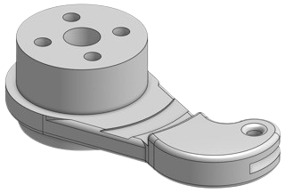
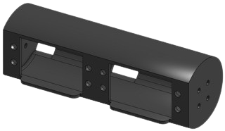
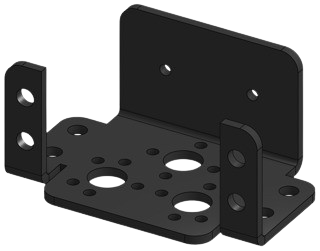
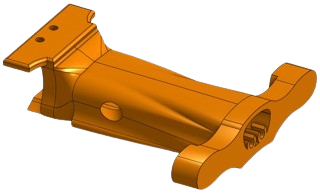
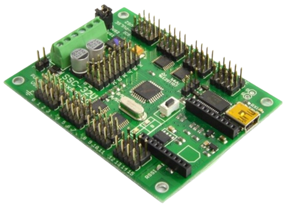
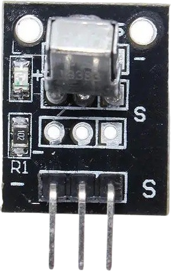
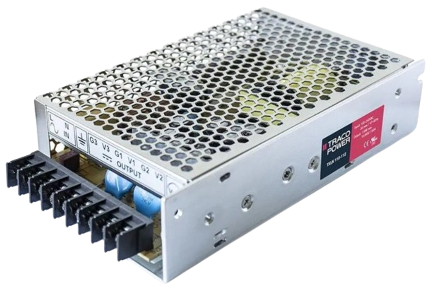

# PolyDog V1

## Presentation

WRITE TEXT

## Summary

- [PolyDog V1](#polydog-v1)
  - [Presentation](#presentation)
  - [Summary](#summary)
  - [Robot Parts](#robot-parts)
    - [Leg parts](#leg-parts)
    - [Body parts](#body-parts)
    - [Electronic Components](#electronic-components)
  - [Flowchart](#flowchart)
    - [Initialization](#initialization)
    - [Remote Control](#remote-control)
    - [Camera](#camera)
    - [Movements](#movements)

## Robot Parts

### Leg parts

<table> <!--Table-->
<tbody> <!--Table Body-->
    <tr> <!-- TABLE HEADER -->
        <th align="center" width="80">Name</th>
        <th align="center" width="250">Preview</th>
        <th align="center">Description</th>
        <th align="center" width="75">Material</th>
    </tr>
    <tr> <!--Line-->
        <td align="center">Femur</td>
        <td align="center">
            
            
        </td>
        <td align="center">Attached to the hip to hold the knee. Is connected to the tibia.</td>
        <td align="center">3D-printed</td>
    </tr>
    <tr> <!--Line-->
        <td align="center">Foot</td>
        <td align="center">
            
        </td>
        <td align="center">Attached at the end of every tibia, it helps with the grip on the floor.</td>
        <td align="center">3D-printed</td>
    </tr>
    <tr> <!--Line-->
        <td align="center">Gear</td>
        <td align="center">
            
        </td>
        <td align="center">Attached to the servo responsible for the whole leg movement. Is connected to the hip.</td>
        <td align="center">3D-printed</td>
    </tr>
    <tr> <!--Line-->
        <td align="center">Hip</td>
        <td align="center">
            
            
        </td>
        <td align="center">Link between the servo motor for the whole leg and the femur. Is moved by a gear. Hold the knee in place.</td>
        <td align="center">3D-printed</td>
    </tr>
    <tr> <!--Line-->
        <td align="center">Knee</td>
        <td align="center">
            
            
        </td>
        <td align="center">Link between the servo motor for the knee and the tendon to make the anatomical knee move. Directly attached to the servo.</td>
        <td align="center">3D-printed</td>
    </tr>
        <tr> <!--Line-->
        <td align="center">Leg Holder</td>
        <td align="center">
            
        </td>
        <td align="center">Hold the two servo motors necessary to make the leg move.</td>
        <td align="center">3D-printed</td>
    </tr>
    <tr> <!--Line-->
        <td align="center">Tendon</td>
        <td align="center">
            
        </td>
        <td align="center">Link between the knee and the tibia.</td>
        <td align="center">3D-printed</td>
    </tr>
    <tr> <!--Line-->
        <td align="center">Tibia</td>
        <td align="center">
            
        </td>
        <td align="center">Link between the foot, the femur and the tibia. Is moved by the tendon and rotates around the point where the femur is attached.</td>
        <td align="center">3D-printed</td>
    </tr>
</tbody>
</table>

### Body parts

<table> <!--Table-->
<tbody> <!--Table Body-->
    <tr> <!-- TABLE HEADER -->
        <th align="center" width="95">Name</th>
        <th align="center">Preview</th>
        <th align="center">Description</th>
        <th aling="center" width="75">Material</th>
    </tr>
    <tr> <!--Line-->
        <td align="center">Back</td>
        <td align="center">
            
        </td>
        <td align="center">Close the robot body to protect and hide all the hardware and cables inside.</td>
        <td align="center">3D-printed</td>
    </tr>
    <tr> <!--Line-->
        <td align="center">Base</td>
        <td align="center">
            
        </td>
        <td align="center">Core of the body structure.</td>
        <td align="center">3D-printed</td>
    </tr>
    <tr> <!--Line-->
        <td align="center">Ribs</td>
        <td align="center">
            
        </td>
        <td align="center">Help with the rigidity of the whole body. Protect the hardware from being hit. Hold the SSC-32.</td>
        <td align="center">3D-printed</td>
    </tr>
    <tr> <!--Line-->
        <td align="center">Servo Bracket</td>
        <td align="center">
            
        </td>
        <td align="center">Hold one servo motor in place.</td>
        <td align="center">Aluminium</td>
    </tr>
    <tr> <!--Line-->
        <td align="center">Spine</td>
        <td align="center">
            
        </td>
        <td align="center">Hold two legs and store the power cable.</td>
        <td align="center">3D-printed</td>
    </tr>
</table>
</tbody>

### Electronic Components

<table> <!--Table-->
<tbody> <!--Table Body-->
    <tr> <!-- TABLE HEADER -->
        <th align="center" width="95">Name</th>
        <th align="center">Preview</th>
        <th align="center">Description</th>
        <th aling="center" width="75">Reference</th>
    </tr>
    <tr> <!--Line-->
        <td align="center">Arduino UNO</td>
        <td align="center">
            
        </td>
        <td align="center">Robot brain.</td>
        <td align="center">XXXX</td>
    </tr>
    <tr> <!--Line-->
        <td align="center">SSC-32 Servo Controller</td>
        <td align="center">
            
        </td>
        <td align="center">Receives command from the Arduino UNO to control every servo motor.</td>
        <td align="center">XXXX</td>
    </tr>
    <tr> <!--Line-->
        <td align="center">Servo motors</td>
        <td align="center">
            
        </td>
        <td align="center">Moves the part of the body they are connected to.</td>
        <td align="center">XXXX</td>
    </tr>
    <tr> <!--Line-->
        <td align="center">Infrared Remote & Receiver</td>
        <td align="center">
            
            
        </td>
        <td align="center">Remote control of the robot movements and actions.</td>
        <td align="center">Aluminium</td>
    </tr>
    <tr> <!--Line-->
        <td align="center">Pixy Cam 2 & Mount</td>
        <td align="center">
            
        </td>
        <td align="center">Camera of the robot. Is able to detect colors. The camera can be moved on 2 axis with it's mount.</td>
        <td align="center">XXXX</td>
    </tr>
    <tr> <!--Line-->
        <td align="center">Power source</td>
        <td align="center">
            
        </td>
        <td align="center">Powers all the electronic components. 30 Amperes and 5 Volts. </td>
        <td align="center">XXXX</td>
    </tr>
</table>
</tbody>

## Flowchart

### Initialization

### Remote Control

### Camera

### Movements
