# PolyDog V1

## Presentation

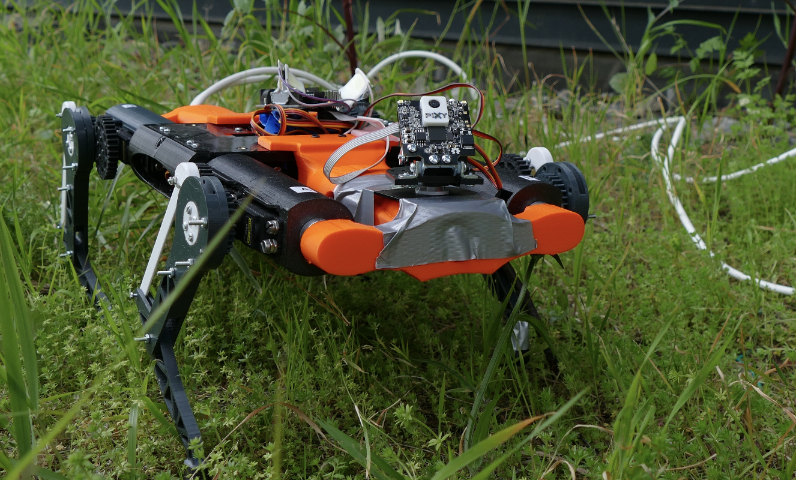

## Summary

- [Presentation](https://github.com/naxomi/peip2-arduino-project#presentation)
- [Summary](https://github.com/naxomi/peip2-arduino-project#summary)
- [Robot Parts](https://github.com/naxomi/peip2-arduino-project#robot-parts)
  - [Leg Parts](https://github.com/naxomi/peip2-arduino-project#leg-parts)
  - [Body Parts](https://github.com/naxomi/peip2-arduino-project#body-parts)
- [Electronic Components](https://github.com/naxomi/peip2-arduino-project#electronic-components)
  - [Arduino UNO](https://github.com/naxomi/peip2-arduino-project#arduino-uno)
  - [SSC-32 Servo Controller](https://github.com/naxomi/peip2-arduino-project#ssc-32-servo-controller)
  - [Servos](https://github.com/naxomi/peip2-arduino-project#servos)
  - [Infrared Remote](https://github.com/naxomi/peip2-arduino-project#infrared-remote)
  - [Pixy Cam 2](https://github.com/naxomi/peip2-arduino-project#pixy-cam-2)
  - [Power Source](https://github.com/naxomi/peip2-arduino-project#power-source)
- [Flowchart](https://github.com/naxomi/peip2-arduino-project#flowchart)
  - [Initialization](https://github.com/naxomi/peip2-arduino-project#initialization)
  - [Remote Control](https://github.com/naxomi/peip2-arduino-project#remote-control)
  - [Camera](https://github.com/naxomi/peip2-arduino-project#camera)
  - [Movements](https://github.com/naxomi/peip2-arduino-project#movements)

## Robot Parts

### Leg parts

<table> <!--Table-->
<tbody> <!--Table Body-->
    <tr> <!-- TABLE HEADER -->
        <th align="center">Name</th>
        <th align="center" width="250">Preview</th>
        <th align="center">Description</th>
        <th align="center">Material</th>
    </tr>
    <tr> <!--Line-->
        <td align="center">Femur</td>
        <td align="center">
            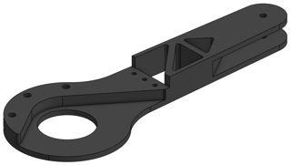
            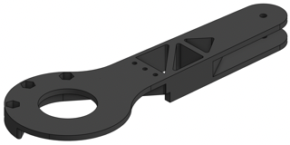
        </td>
        <td align="center">Attached to the hip to hold the knee. Is connected to the tibia.</td>
        <td align="center">3D-printed</td>
    </tr>
    <tr> <!--Line-->
        <td align="center">Foot</td>
        <td align="center">
            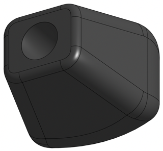
        </td>
        <td align="center">Attached at the end of every tibia, it helps with the grip on the floor.</td>
        <td align="center">3D-printed</td>
    </tr>
    <tr> <!--Line-->
        <td align="center">Gear</td>
        <td align="center">
            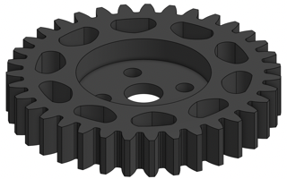
        </td>
        <td align="center">Attached to the servo responsible for the whole leg movement. Is connected to the hip.</td>
        <td align="center">3D-printed</td>
    </tr>
    <tr> <!--Line-->
        <td align="center">Hip</td>
        <td align="center">
            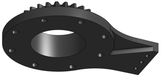
            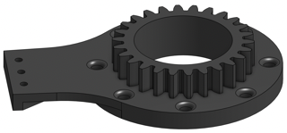
        </td>
        <td align="center">Link between the servo motor for the whole leg and the femur. Is moved by a gear. Hold the knee in place.</td>
        <td align="center">3D-printed</td>
    </tr>
    <tr> <!--Line-->
        <td align="center">Knee</td>
        <td align="center">
            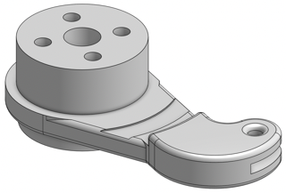
            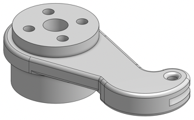
        </td>
        <td align="center">Link between the servo motor for the knee and the tendon to make the anatomical knee move. Directly attached to the servo.</td>
        <td align="center">3D-printed</td>
    </tr>
        <tr> <!--Line-->
        <td align="center">Leg Holder</td>
        <td align="center">
            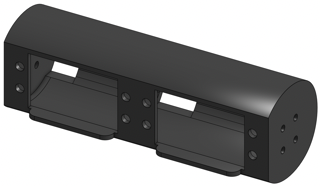
        </td>
        <td align="center">Hold the two servo motors necessary to make the leg move.</td>
        <td align="center">3D-printed</td>
    </tr>
    <tr> <!--Line-->
        <td align="center">Tendon</td>
        <td align="center">
            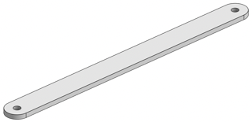
        </td>
        <td align="center">Link between the knee and the tibia.</td>
        <td align="center">3D-printed</td>
    </tr>
    <tr> <!--Line-->
        <td align="center">Tibia</td>
        <td align="center">
            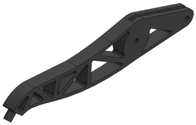
        </td>
        <td align="center">Link between the foot, the femur and the tibia. Is moved by the tendon and rotates around the point where the femur is attached.</td>
        <td align="center">3D-printed</td>
    </tr>
</tbody>
</table>

### Body parts

<table> <!--Table-->
<tbody> <!--Table Body-->
    <tr> <!-- TABLE HEADER -->
        <th align="center">Name</th>
        <th align="center">Preview</th>
        <th align="center">Description</th>
        <th aling="center">Material</th>
    </tr>
    <tr> <!--Line-->
        <td align="center">Back</td>
        <td align="center">
            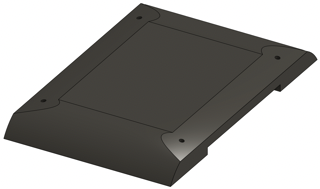
        </td>
        <td align="center">Close the robot body to protect and hide all the hardware and cables inside.</td>
        <td align="center">3D-printed</td>
    </tr>
    <tr> <!--Line-->
        <td align="center">Base</td>
        <td align="center">
            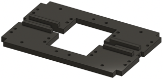
        </td>
        <td align="center">Core of the body structure.</td>
        <td align="center">3D-printed</td>
    </tr>
    <tr> <!--Line-->
        <td align="center">Ribs</td>
        <td align="center">
            
        </td>
        <td align="center">Help with the rigidity of the whole body. Protect the hardware from being hit. Hold the SSC-32.</td>
        <td align="center">3D-printed</td>
    </tr>
    <tr> <!--Line-->
        <td align="center">Servo Bracket</td>
        <td align="center">
            
        </td>
        <td align="center">Hold one servo motor in place.</td>
        <td align="center">Aluminium</td>
    </tr>
    <tr> <!--Line-->
        <td align="center">Spine</td>
        <td align="center">
            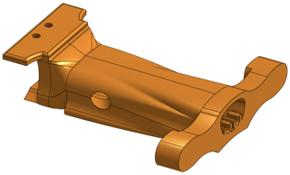
        </td>
        <td align="center">Hold two legs and store the power cable.</td>
        <td align="center">3D-printed</td>
    </tr>
</table>
</tbody>

## Electronic Components

### Arduino UNO

### SSC-32 Servo Controller

### Servos

### Infrared Remote

### Pixy Cam 2

### Power source

## Flowchart

### Initialization

### Remote Control

### Camera

### Movements
