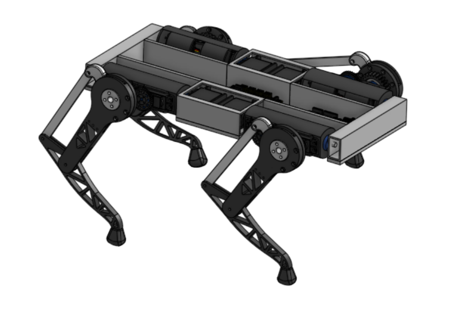

# Séance 1 - version 2 de PolyDog

## Semaine du 04 avril 2022 - 17 avril 2022

-----

Nous avons eu des difficultés à se mettre en route pour commencer la deuxième version de notre robot chien : PolyDog_v2.

**1. Étape 1 - Bilan et synthèse de la v1 -**

Les points noirs de la version 1 sont :

* Le poids trop élevé du corps. Masse volumique du PETG trop grande.

* Les servo-moteurs ont un couple trop faible (13kg/cm). Le robot a du mal à effectuer des mouvements (cumulé avec un poids trop important)

* L'engrenage entre la hanche et le servo-moteur. L'embout en plastique s'use facilement. Le degré de liberté d'un pas de pignon augmente.

##### Corps en aluminium

Nous avons donc décidé de réaliser le corps du robot en aluminium, assemblé avec des équerres et des charnières.

<figure align="center">
  
  <figcaption>Des carrés d'alu viennent se fixer sur une plaque en aluminium ou de plexiglass</figcaption>
</figure>

##### Engrenage double hélice

Pour renforcer la stabilité de l'engrenage, j'ai modélisé deux double helical gear qui vont se coincer dans la roue dentée double helice de la hanche. J'ai trouvé cette idée sur YouTube : https://www.youtube.com/watch?v=pxgut7d135w&t=162s

Cela donne ceci :

<figure align="center">
  
  <figcaption></figcaption>
</figure>

>Je n'ai pas encore réussit à modifier l'angle d'offset pour que les deux roues dentées soit synchronisé deux à deux.

En attendant j'ai prédéfini le matériel à acheter pour la construction du corps en aluminium.

**Achat matos:**

* carre d'alu : 32mm (longueur), 16mm (largeur_intérieur), 28 (hauteur_intérieur) ---> prévu 4mm d'épaisseur
 
* carre d'alu : 200mm (longeur), 58mm (largeur_intérieur) 28 (hauteur_intérieur) --->prévu 4mm d'épaisseur, je n'y connais rien
 
* plaque d'alu ou plaque de pléxiglass: 5mm d'épaisseur, 414 x 184mm;
