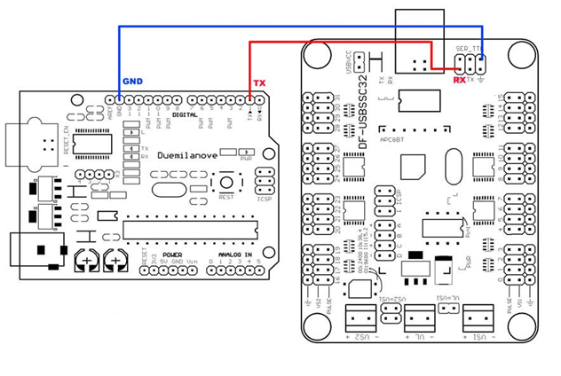

# Séance du 23/02/2022

## Adaptation du code pour le nouveau controleur de servo moteur

Pour envoyer une commande à un servo branché sur le pin 4, pour qu'il aille à un angle de 90 degré en 500 millisecondes, on écrit :

```c++
//Code en Arduino
#4P1000T500;
```

1. ### `CustomServos`

De plus, dans la classe CustomServos, nous n'avons plus la nécessité d'attacher les servos à un pin particulier (~~servo_lambda.attach(4)~~).

J'ai alors modifié la classe CustomServos en y ajoutant les fonctions suivantes :

```c++
void CustomServos::move(int position, int time)
{
  Serial.print("#");
  Serial.print(this->_pin);
  Serial.print(" P");
  Serial.print(position);
  Serial.print(" T");
  Serial.println(time);
  delay(time);
}

// Modification de la fonction write, pour que l'on puisse garder notre code avec des angles compris entre 0 et 180 degré, par comodité

void CustomServos::write(int angle)
{
  this->move(map(angle, 0, 180, 500, 2500), 0);
}
```

## Problème de réglage

1. Nous nous sommes rendu compte que le servo controller n'était pas autonome et ne pouvait pas stocker en mémoire les commandes. Nous avions donc besoin d'une carte Arduino pour faire l'intermédiaire et de transmettre les infos sur le serial;

Voici le montage :

<figure align="center">
  
</figure>

2. Ensuite, deuxième soucis, le code se transférait successfullement sur la carte UNO mais cette dernière ne relayait pas l'information au servo controller. Les led RX et TX demeuraient éteinte. Après des heures et des heures de recherches en vain, il suffisait en réalité de recréer un projet sur PlateformIO et de transférer le code, et ça a marché.

## Impression des pièces

En mettant la pièce des côtes du bas dans le slicer de l'imprimante, le poids serait de 230gr, je l'ai donc modifié ainsi avant impression :

<figure align="center">
  
</figure>

J'ai modifié également les bras de maintien des épaules (ou plus logiquement la colonne vertebrale), en y perçant son centre :

<figure align="center">
  
</figure>

J'ai rajouté également deux clips pour les cables pour tester si cela fonctionne mais pour le moment j'en suis pas très convaincu.