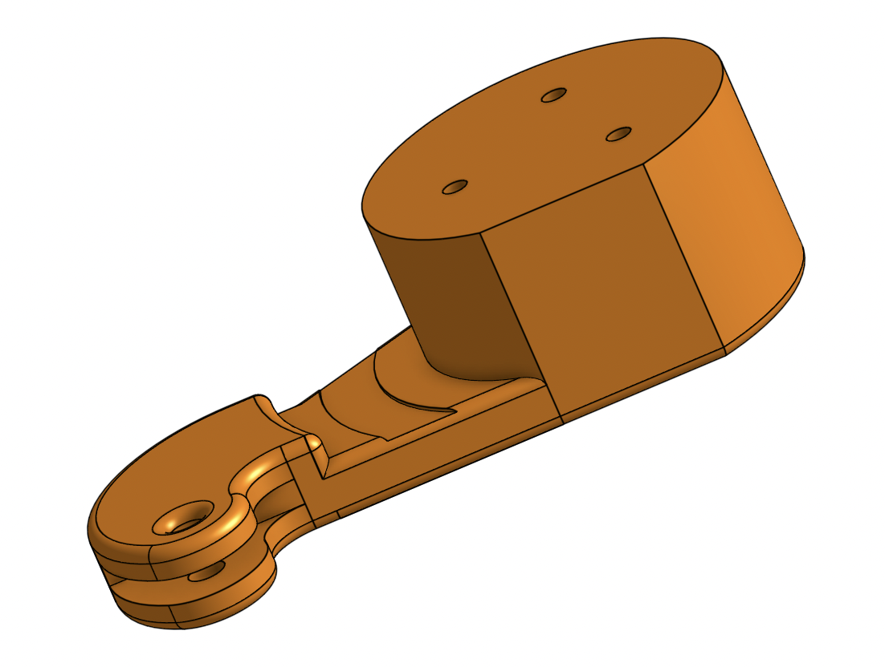

# Séance 3 : 03/12/2021 --> 16/12/2021

Le temps que j'ai passé sur le robot a quasi intégralement était passé sur le mécanisme de la patte et de sa hanche.

### Placement des moteurs

J'ai utilisé des bouts de cartons et les moteurs que j'avais à disposition pour visualiser au mieux les différents moyens
de placer les moteurs pour que la patte fonctionne.

Après beaucoup de discussion avec Hugo et nos recherches, nous avons trouvé un modèle qui nous semble faisable. Et dont
le mécanisme se rapproche le plus de ce que nous avons en tête.

### Modélisation 3D

Nous utilisons OnShape pour la modélisation 3D.
J'ai modifié la pièce de la "hanche" et celle du "genou" pour correspondre à notre idée. 

##### Le genou 

#### La hanche

Enfin, j'ai commencé à assembler ensemble les moteurs et la patte. Je me suis rendu que faire notre propre support serait
plus facile pour placer les moteurs et éviter les erreurs.
J'ai donc utilisé un modèle 3D d'un socle "officiel" pour avoir les bonnes mesures et ainsi créer notre propre socle.

#### Socle personnalisé

#### Rendu actuel de la patte

#### Objectifs
Il reste encore des pièces à modéliser notamment pour connecter la hanche à l'un des moteurs. Il faut aussi mettre la place
le 3ème moteur dans le modèle 3D.
Une fois le modèle d'une patte modélisé nous pourrons le dupliquer pour les 4 pattes et ainsi commencer à faire la structure
de notre robot.