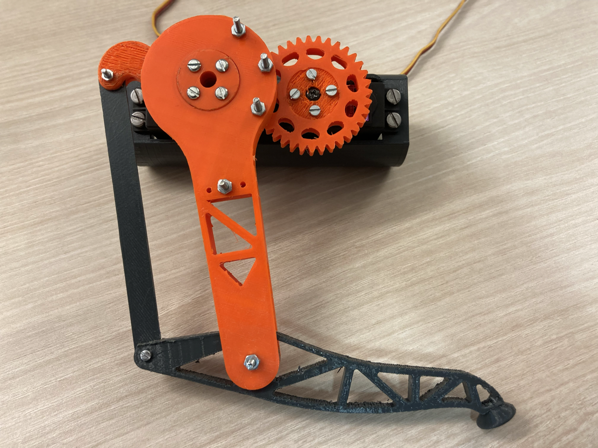
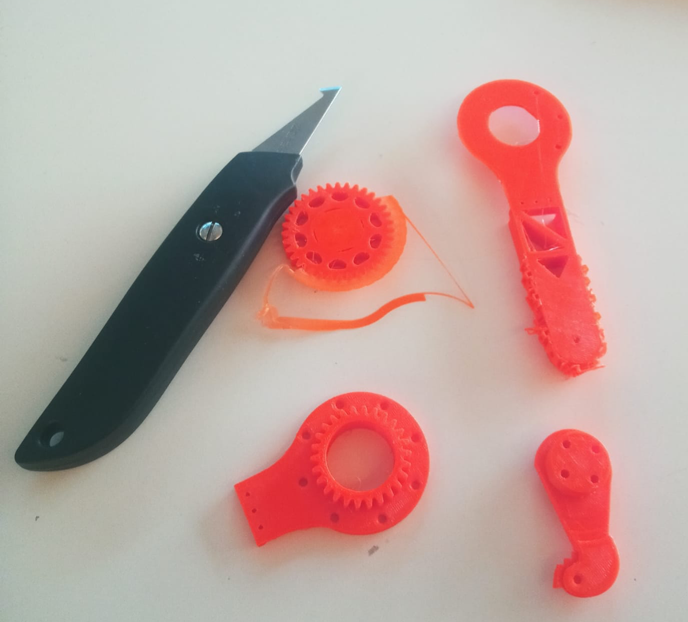

# Séance 4 : 06/01/2022 --> 13/01/2022

&nbsp;&nbsp;&nbsp;&nbsp;De gros progrès ont été fait au cours de la semaine. Nous avons donc quasiment fini la version
définitive de notre prototype de patte. Les éléments sur lesquels j'ai travaillé pour en arriver là sont détaillés 
ci-dessous.

### Prototype actuel de la patte :

### Révision du mécanisme

&nbsp;&nbsp;&nbsp;&nbsp;L'ancien mécanisme que nous avions créé était fonctionnel, mais ne nous permettait pas d'avoir
l'amplitude de mouvement dont nous avions besoin. Cela été dû à la réduction d'un engrenage a 25 dents vers un engrenage
à 40 dents. La solution a donc été de tout simplement agrandir l'engrenage directement relié au moteur et de réduire celui
accroché à la pâte. Ainsi, nous avons une bien plus grande amplitude du mouvement de la patte malgré la limite de 180° du
moteur.

### Nettoyage des pièces après leur impression

&nbsp;&nbsp;&nbsp;&nbsp;Le dur labeur de devoir nettoyer toutes les structures permettant l'impression des pièces 3D. Ce
n'est pas plus amusante des parties, mais elle est nécessaire et doit être faite correctement pour que le résultat soit de
qualité.

### Mise en mouvement des moteurs (utilisation d'un potentiomètre ou utilisation d'une séquence prédéfinie)

&nbsp;&nbsp;&nbsp;&nbsp;J'ai réalisé deux petits programmes (et réalisés leurs systèmes électroniques respectifs)
permettant la mise en mouvement des moteurs.

&nbsp;&nbsp;&nbsp;&nbsp;Le premier permet de manipuler les moteurs séparément avec leur propre potentiomètre. On peut
ainsi voir les limites des mouvements possibles, mais aussi récupérer des valeurs d'angle qui vont servir dans le second
programme.

&nbsp;&nbsp;&nbsp;&nbsp;Le second est tout simplement une suite de commandes que l'Arduino transmet aux moteurs. Cela
effectue un cycle afin qu'il s'exécute en continu. Le mouvement n'est pas celui que l'on utilisera pour la marche mais
donne une idée de ce que l'on peut faire.

### Corrections minimes concernant les pièces 3D

&nbsp;&nbsp;&nbsp;&nbsp;Nous avons fait plusieurs itérations des pièces de la patte dont Hugo a fait la majorité des
modélisations. Ces itérations nous ont notamment permises de corriger la taille de certains trous, leurs emplacements,
ainsi que la précision d'assemblage de certaines.

### Utilisation de Adafruit PCA9685 16-Channel Servo Driver

&nbsp;&nbsp;&nbsp;&nbsp;Étant donné que nous allons devoir connecter 12 servos moteurs à notre Arduino, M. Masson nous a
conseillé d'utiliser un module Adafruit qui permet de gérer jusqu'à 16 moteurs simultanément.

&nbsp;&nbsp;&nbsp;&nbsp;J'ai donc tout d'abord cherché la documentation du module afin de comprendre comme il fonctionnait
et comment je pouvais le brancher avec l'Arduino. Simultanément je suis tombé sur un bout de code permettant de faire une
première utilisation du module Arduino et découvrir ses méthodes. Une fois les branchements réalisés plus ou moins 
correctement après de multiples essais, mes deux moteurs étaient enfin opérationnels.

