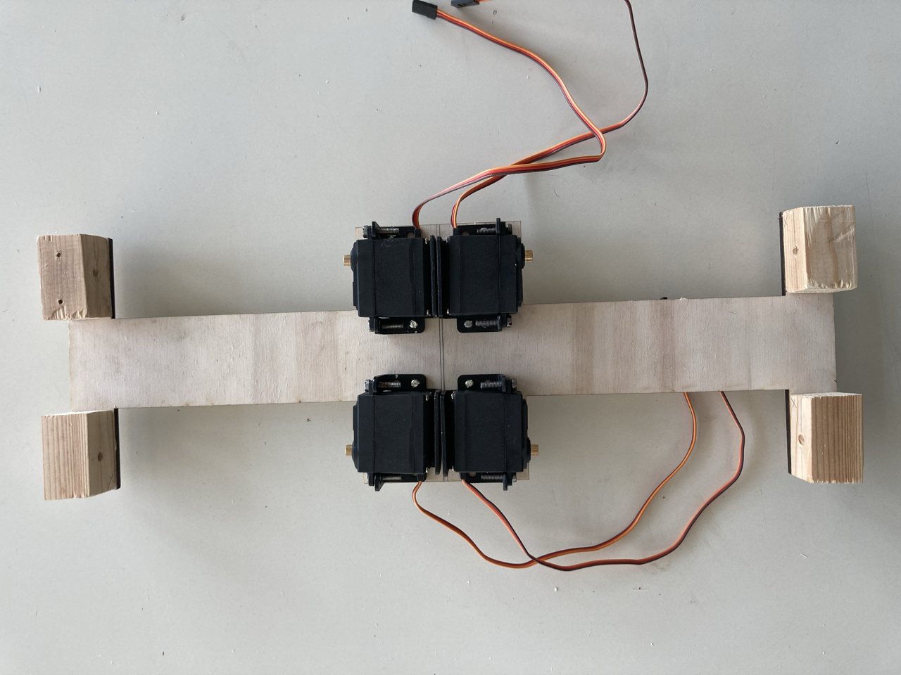
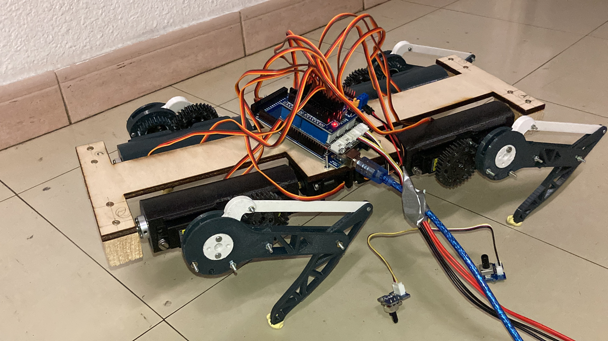
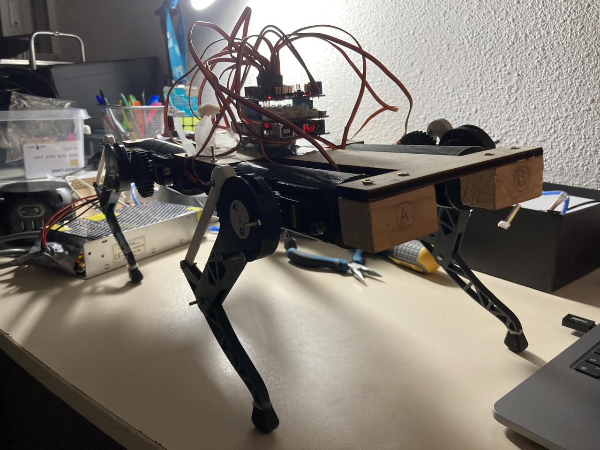

# Séance 5 : 14/01/2022 -> 03/02/2022

## Création d'un corps plus grand

&nbsp;&nbsp;&nbsp;&nbsp;Pour l'instant le corps est toujours en bois pour que
nous puissont tester l'équilibre du robot avec cette largeur avant d'un imprimer un en 3D. Nous avons
toutefois dû recouper au laser une v2 plus large que la v1, et prenant mieux en
compte les libertés des modules des pattes

## Installation des moteurs des épaules et des socles pour les différents axes.

&nbsp;&nbsp;&nbsp;&nbsp;Les moteurs sont fixés aux bois grâce aux socles fournis par M. Masson. Il a fallu percer le bois aux bons endroits pour que ceux-ci soit bien orienté. \
&nbsp;&nbsp;&nbsp;&nbsp;De plus, je me suis occupé de réaliser les socles qui reçoicent l'axe de l'épaule. Ceux-ci devaient être le plus précis possible afin de ne pas avoir de décalage entre l'emplacement du moteur et le trou pour l'axe.

## Installation des pattes

&nbsp;&nbsp;&nbsp;&nbsp;Installer les pattes n'étaient pas aussi facile que nous l'espérions. En effet, il faut bien placer nos pièces sur l'axe du servo afin que celle-ci est l'amplitude correcte de mouvement. \
&nbsp;&nbsp;&nbsp;&nbsp;J'ai donc testé chaque patte avec un petit programme permettant de bouger les servos avec deux potentiomètres.

## Première fois debout (!!!)

&nbsp;&nbsp;&nbsp;&nbsp;J'ai cherché les valeurs précises pour chaque servo afin que le robot puisse tenir debout, et nous avons réussi !

&nbsp;&nbsp;&nbsp;&nbsp;En revanche, on a quelques problèmes de tremblement probablement dû à un problème d'alimentation (malgré les 5V 30A théoriquement nécessaire).

## Finalement fonctionnel

&nbsp;&nbsp;&nbsp;&nbsp;Après modifications du branchement entre l'alimentation et l'Arduino MEGA, le robot a cessé de trembler !

## Visserie

&nbsp;&nbsp;&nbsp;&nbsp;Pas de photos pour cette étape malheureusement, mais avec Hugo nous avons placé toutes les vis nécessaires pour que notre robot tienne la route. En effet, avec seulement les vis que nous avions mises nous avions des problèmes de pièces qui ne tiennent pas ou se dévissent...

## Au niveau du code

&nbsp;&nbsp;&nbsp;&nbsp;L'écriture du code a évolué continuellement depuis le dernier rapport séance.

### PlatformIO

&nbsp;&nbsp;&nbsp;&nbsp;J'ai appris à utiliser PlatformIO afin de pouvoir uploader dans l'Arduino les programmes depuis Visual Studio Code. Nous utiliserons donc maintenant la structure des fichiers de PlateformIO. \
&nbsp;&nbsp;&nbsp;&nbsp;En revanche, l'arborescence du dossier `src` de notre projet n'est pas du tout optimale. Ranger tout cela est un des objectifs de la semaine.

[Emplacement du dossier PlatformIO](src/LearningPlatformIO)

### Les classes

&nbsp;&nbsp;&nbsp;&nbsp;J'ai commencé à créer des classes en C++ pour notre projet afin de pouvoir controler les servos plus spécifiquement. Plus de classes verront le jour par la suite en fonction de nos besoins.

[Emplacement de la classe](src/LearningPlatformIO/lib/CustomServos)

### Programme pour tester la rotation des servos

&nbsp;&nbsp;&nbsp;&nbsp;Ce programme permet de controller facilement deux servos simplement grâce à deux potentiomètres branchés sur le bloc de contrôle du robot.

[Emplacement du programme](src/LearningPlatformIO/src/test-servo.cpp)
