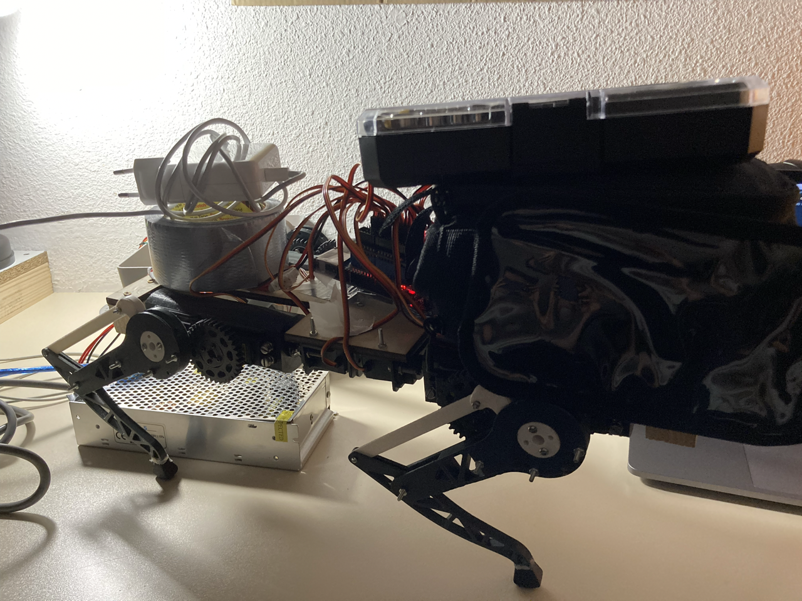
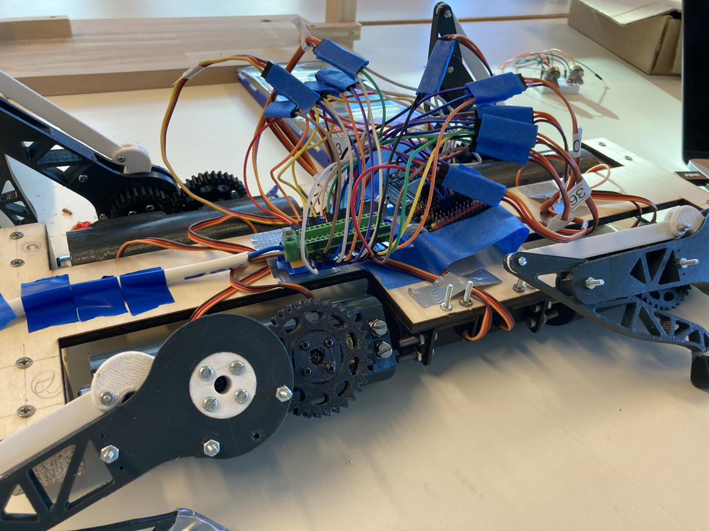

# Séance 5 : 04/02/2022 -> 11/02/2022

## Test de résistance au poids

&nbsp;&nbsp;&nbsp;&nbsp;Nous avons posé quelques objets sur le robot lorsqu'il est en position debout afin de tester sa résistance.

## Description du code écrit

&nbsp;&nbsp;&nbsp;&nbsp;Le code évolue avec le projet pour répondre aux nouveaux
besoins que l'on rencontre, mais aussi pour simplifier son implémentation. Je
vais ici décrire l'état actuel du code, ainsi que son fonctionnement.

> Librairies créées

&nbsp;&nbsp;&nbsp;&nbsp;J'ai créé deux classes : `CustomServos` et `PolyDog`.
La première permet d'implémenter des méthodes pour controler plus facilement les
servos moteurs. Dans son état actuel il n'y a que très peu de différences avec
le module `Servo` mais je pense pouvoir la diversifier pour nous faciliter le travail dans certains cas. La seconde est très importante car elle permet de controler
le robot et implémente toutes les méthodes de mouvements de celui-ci.

> CustomServos

&nbsp;&nbsp;&nbsp;&nbsp;Cette classe est construire sur la classe `Servo` et son fonctionnement est très similaire.

- `CustomServos.CustomServos(pin)` : constructeur d'un objet, `pin` est le pin de control du servo moteur.
- `CustomServos.attach()` : permet d'attacher le servo moteur au pin spécifié dans le constructeur.
- `CustomServos.write(angle)` : appelle simplement `Servo.write(angle)`.
- `CustomServos.control_with_potentio(int pin_potentio)` : permet de controler le `CustomServos` actuel avec un potentiometre dont le pin est spécifié en argument.
- `CustomServos.control_two_with_potentio(CustomServos servo2, int pin_potentio1, int pin_potentio2)` : permet de controller le `CustomServos` actuel et un autre spécifié en argument. Les pins des deux potentiomètres doivent aussi être indiqués dans les arguments.

> PolyDog

&nbsp;&nbsp;&nbsp;&nbsp;Cette classe permet de controler tous les mouvements du robot.

- `PolyDog.PolyDog()` : constructeur d'un objet. Permet d'initialiser 12 `CustomServos`correspondant à ceux du robot. Les pins sont directement implémentés par défaut dans le constructeur pour éviter les erreurs.
- `PolyDog.start()` : permet de mettre le robot dans une position levée stable.
- `PolyDog.forward_leg(int leg_number, int step, int offset_hanche, int offset_genou)` : permet de faire bouger les servos de la jambe à une certaine position du mouvement pour aller de l'avant. `step` permet d'indiquer le moment désiré. Les deux offset permettent d'indiquer la différence d'angle par rapport à celui de départ. Dans notre cas, les jambes **A et D** ont besoin d'un offset de 180° par rapport aux jambes **B et C**. `leg_number` indique la jambe à controler. Dans notre cas : **1->A**, **2->B**, **3->C**, **4->D**.
- `PolyDog.hold_shoulders()` : permet de positionner les servos moteurs des épaules dans une position où les jambes sont perpendiculaires au sol. Cette méthode est appelée dans `PolyDog.start()` par exemple.
- `PolyDog.attach_all_motors()` : permet d'attacher tous les servos moteurs du robot. Cette méthode doit impérativement être appelée dans le `setup()` pour que le robot soit controllable.
- `PolyDog.move_forward()` : permet de faire avancer le robot en suivant le pattern précisé dans `PolyDog.forward_leg()`. Il est possible de mettre un décalage entre l'exécution des mouvements de chaque jambe ce qui donne l'impression de controler les mouvements simultanéments.

## Recherches d'une séquence de marche

&nbsp;&nbsp;&nbsp;&nbsp;Pour faire avancer notre robot, il est nécessaire de trouver une séquence de mouvement plus ou moins longue lui permettant de se déplacer. J'ai rencontré de grandes difficultés sur ce point là. En effet, il faut réussir à synchroniser les mouvements des jambes pour que le robot ne perde pas l'équilibre, réussir à lever suffisamment la perte pour qu'il avance mais pas trop pour qu'il ne tompe pas, réussir à répartir correctement le poids entre les pattes etc...  
&nbsp;&nbsp;&nbsp;&nbsp;De nombreux problèmes qui ont donc induits de nombreuses itérations du programme de mouvement en avant. J'ai essayé avec des séquences plus ou moins longues, une répartition temps en l'air / temps sur terre plus ou moins grande, ou encore avec des décalages entre les pattes différents. Le résultat n'est pas toujours pas concluant mais vous trouverez dans la section suivante toutes les illustrations du parcours de notre robot vers la liberté de mouvement.

## Parcours du robot en vidéos (Youtube)

[Deux jambes simultanéments](https://youtu.be/BQK5qwYhp8c)  
[4 jambes mais sur le dos](https://youtu.be/-I2CmnTHJ1Y)  
[Toute première marche](https://youtu.be/czDSCy8KdlA)  
[Même cycle de marche que la première fois, mais les branchements sont organisés](https://youtu.be/wdTeotGUBME)  
[Il rampe... mais rapidement !](https://youtu.be/WcdHqzSt2Vk)  
[Il marche ! (à peu près...)](https://youtu.be/P47AMKD66D0)  
[Lentement... mais sûrement... le PolyDog avance...](https://youtu.be/SjZvboL3cDo)  
(J'ai atteint la limite journalière d'upload sur Youtube donc je rajouterais les vidéos suivantes petit à petit)

## Problèmes d'alimentation

&nbsp;&nbsp;&nbsp;&nbsp;Nous avons rencontré de nombreux problèmes au niveau de l'alimentation. Tout d'abord, nous pensions que le problème venait de notre montage entre une _Arduino Mega_ et un _Shield Adafruit_ que nous avions et qui n'était pas adapté pour alimenter autant de servo moteurs. Nous avons donc ensuite refait tout le montage avec une autre carte Mega ne nécessitant pas de _Shield_ cette fois-ci.

AJOUTER UNE PHOTO DE LA CARTE V1  
AJOUTER UNE PHOTO DE LA CARTE V2

&nbsp;&nbsp;&nbsp;&nbsp;Le problème n'était toujours pas résolu donc nous avons mesuré la tension de notre montage. À notre surprise, celle-ci était de 3.5V au lieu des 5V nécessaire. L'alimentation fournissait belle et bien 5V, mais à l'entrée de la carte il n'y avait que 3.5V. Le seul coupable restant était notre cable d'alimentation.  
&nbsp;&nbsp;&nbsp;&nbsp;Nous avons donc coupé en deux le cable pour vérifié si la perte de tension venait ou non de ce problème. Avec maintenant une demi-longueur de cable branchée, nous avons 4.5V, ce qui est quasiment les 5V nécessaires.
&nbsp;&nbsp;&nbsp;&nbsp;Il est donc possible de plusieurs de mes algorithmes de mouvement n'est pas fonctionné du simple fait qu'il n'y avait pas assez de tension pour faire fonctionner correctement les servo moteurs...

&nbsp;&nbsp;&nbsp;&nbsp;Les problèmes ne s'arrêtent pas là puisque nous soupçonnons maintenant un problème en raison des branchemnent internes de l'Arduino. Il est possible que le 4.5V que nous avons est du mal à atteindre tous les moteurs.  
&nbsp;&nbsp;&nbsp;&nbsp;Aux grands maux les grands remèdes, seulement les pins de signaux sont branchés directement dans l'Arduino. Le **5V** et le **GND** sont branchés dans un domino d'un ancien _Shield_ qui lui-même est directement relié à l'alimentation. Ce système semble fonctionner mais nous attendons avec impatience une nouvelle carte dont le fonctionnement a été pensé pour utiliser autant de servo moteurs.

