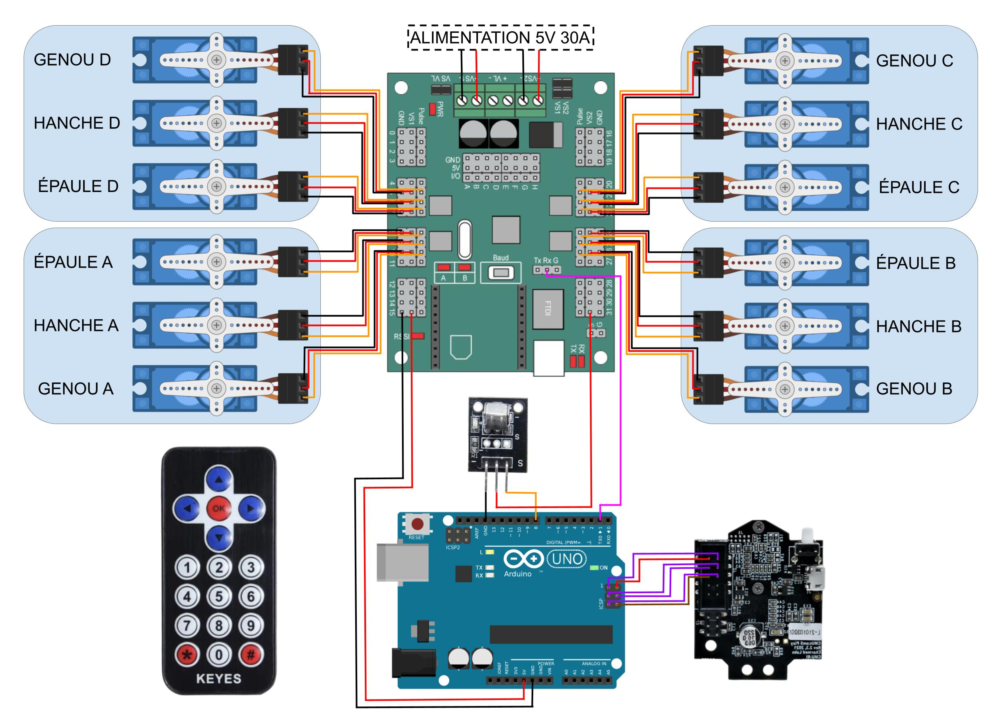
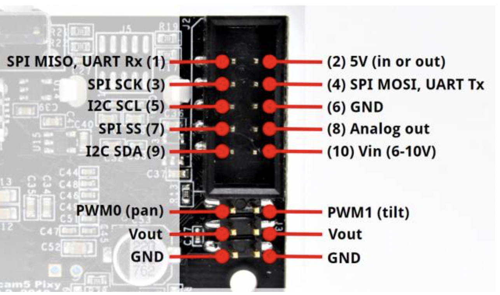
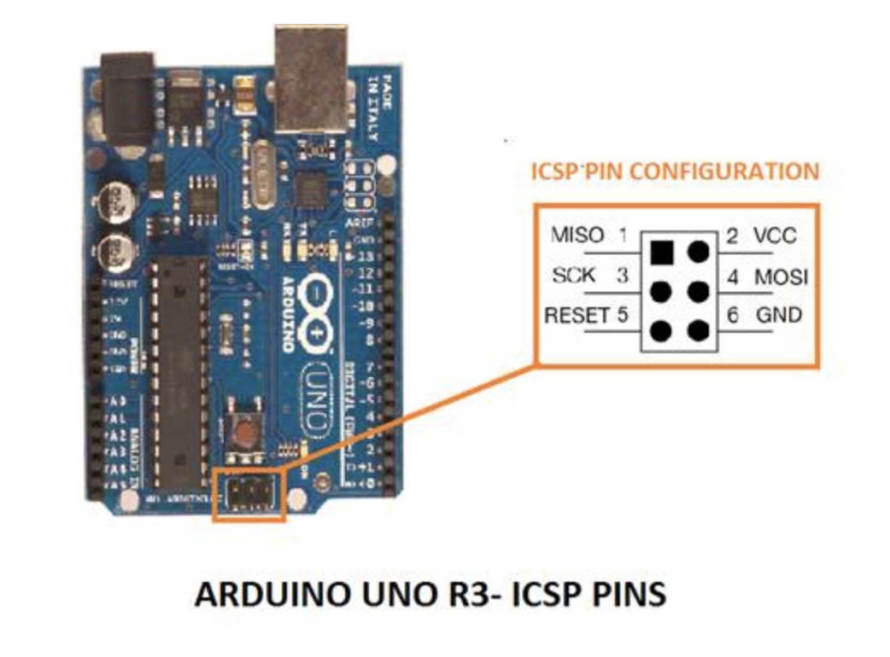
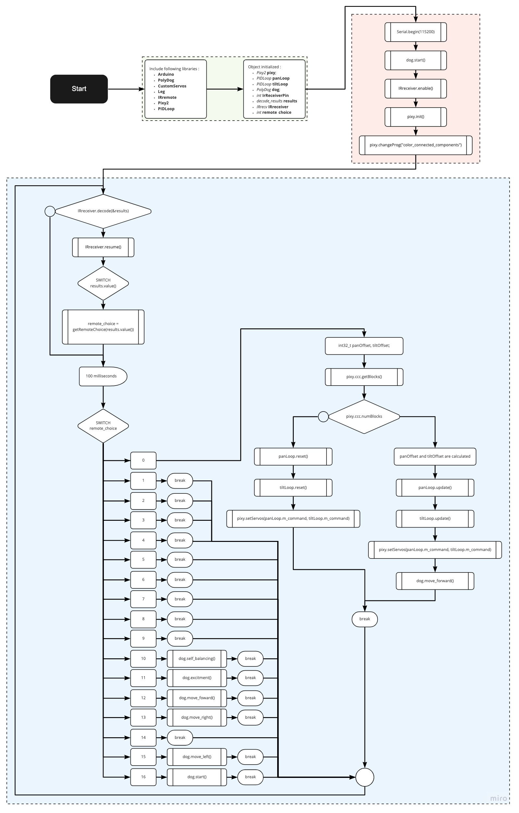

# Séance 8 : 27/02/2022 -> 03/03/2022

## Refactoring et nettoyage de tout le code

&nbsp;&nbsp;&nbsp;&nbsp;J'ai nettoyé tout le code, enlevé les commentaires en trop, renommé des variables qui devaient l'être etc... Cela m'a pris un certain temps mais c'était nécessaire afin de pouvoir rendre un code propre.

## Documentation

&nbsp;&nbsp;&nbsp;&nbsp;J'ai fait la documentation de toutes les méthodes et toutes les classes du code. J'ai respecté les normes de documentation pour le C++, qui sont très proches de celles pour JavaDoc. Cela représente un assez gros travail mais permettra à un utilisateur ne connaissant pas le projet de le comprendre mieux que s'il n'y avait rien.  
&nbsp;&nbsp;&nbsp;&nbsp;Je n'ai pas inclus de screen de la documentation mais vous pourrez la voir dans chacun des fichiers du dossier suivant : [src](../src/SSC-32_servo-controller/src/)

## Copyright

&nbsp;&nbsp;&nbsp;&nbsp;J'ai rajouté une license Open Source (Apache 2.0) au projet. Celui-ci pourra donc être réutilisé par ceux qui le souhaitent.

> Copyright (c) 2022-2022. ANJOU Raphaël & DURAND Hugo  
> Licensed under the Apache License, Version 2.0 (the "License"); you
> may not use this file except in compliance with the License.
>
> You may obtain a copy of the License at
>
> http://www.apache.org/licenses/LICENSE-2.0
>
> Unless required by applicable law or agreed to in writing, software
> distributed under the License is distributed on an "AS IS" BASIS,
> WITHOUT WARRANTIES OR CONDITIONS OF ANY KIND, either express or implied.  
> See the License for the specific language governing permissions and
> limitations under the License.

## PolyDog circuit

&nbsp;&nbsp;&nbsp;&nbsp;J'ai réalisé tout le circuit électronique du robot. Je me suis servi de Google Drawing pour faire les cables. Ce travail est assez fastidieux mais le résultat est concluant.  
&nbsp;&nbsp;&nbsp;&nbsp;J'ai rencontré des difficultés pour comprendre le branchement ICSP entre la Pixy2 et l'Arduino UNO car un cable est fourni avec la caméra.

&nbsp;&nbsp;&nbsp;&nbsp;Voici les informations que j'ai utilisé pour le branchement entre l'arduino UNO et la Pixy2.

## Organigramme logique du main.cpp

&nbsp;&nbsp;&nbsp;&nbsp;J'ai construit l'organigramme du main.cpp de notre projet afin de l'inclure dans notre projet. Je dois me renseigner sur s'il est nécessaire ou non de faire le diagramme pour chaque méthode appelé dans le programme.

